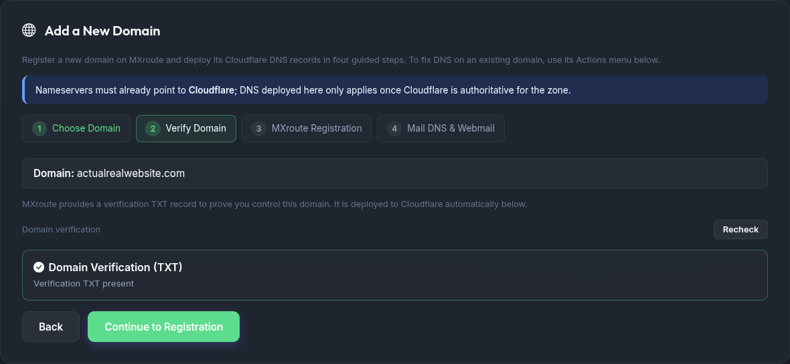
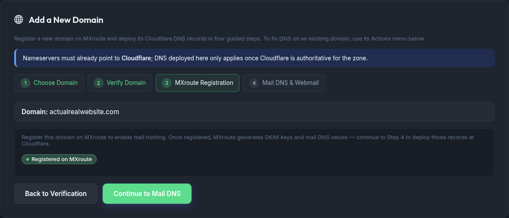
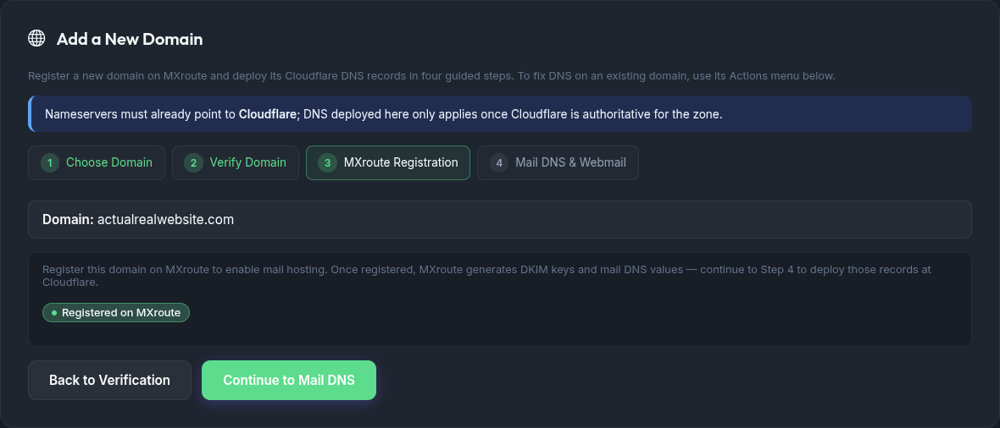
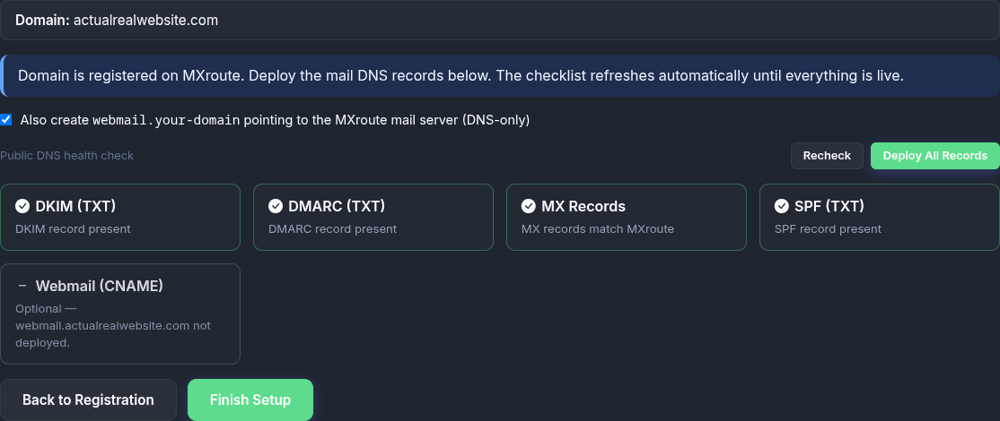
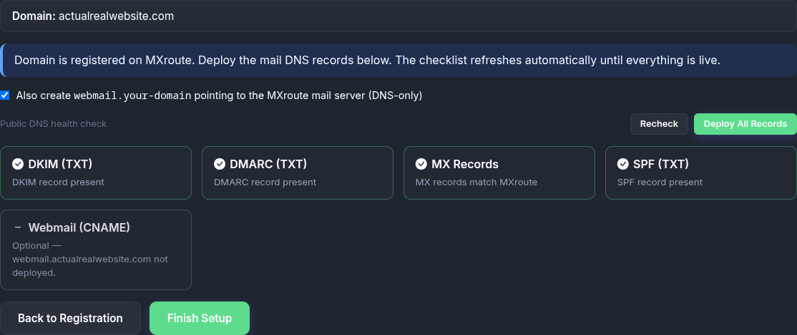
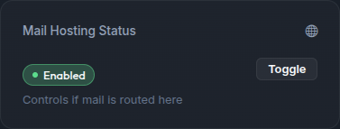

# Adding a domain

This guide walks through onboarding a **new domain** in MXroute Manager: domain verification, MXroute registration, and mail DNS at Cloudflare. The flow uses the **Add a New Domain** wizard on the **Domains** tab.

To fix DNS, manage routing, set up webmail, or delete an **existing** domain, use that domain's **Actions** menu in the **Active Domains** table (see [Managing existing domains](#managing-existing-domains)).

Screenshots in this guide come from a live setup of `actualrealwebsite.com`. Your domain name and record values will differ, but the steps are the same.

## Before you start

| Requirement | Why |
| --- | --- |
| **MXroute API** configured | Settings or `.env` (`MX_SERVER`, `MX_USER`, `MX_API_KEY`). See [Configuration](configuration.md). |
| **Domain in your MXroute account quota** | Registration happens through the wizard, not the MXroute panel. |
| **Cloudflare** (recommended) | The wizard deploys and updates DNS records automatically. Set `CF_API_TOKEN` and `CF_ACCOUNT_ID` in Settings or `.env`. |
| **Domain zone in Cloudflare** | The domain's nameservers must already point to Cloudflare so the app can manage its DNS. |

You need **admin** access. Delegated users cannot register new domains or use this wizard (they can still fix DNS on domains they are granted via the Actions menu).

## Overview

The wizard is a linear four-step flow for new domains:

1. **Choose Domain** - enter the new domain name (nameservers must already be on Cloudflare).
2. **Verify Domain** - the verification TXT record is pulled from MXroute and deployed to Cloudflare automatically.
3. **MXroute Registration** - register the domain so DKIM and mail records become available.
4. **Mail DNS & Webmail** - deploy MX, SPF, DKIM, DMARC (and optionally `webmail.<domain>`); the checklist auto-refreshes until everything is live.

Mail records (MX, SPF, DKIM, DMARC) only exist **after** Step 3, which is why registration comes before mail DNS.

## Step 1: Choose your domain

1. Open **Domains** in the sidebar.
2. In **Add a New Domain**, confirm the domain's nameservers already point to Cloudflare.
3. Enter the domain name (for example `actualrealwebsite.com`).
4. Click **Continue to Verification**.

## Step 2: Verify the domain

MXroute needs a verification TXT record before it will accept registration. On entering Step 2 the wizard fetches that record and deploys it to Cloudflare automatically (when Cloudflare is configured).

1. Watch the **Domain Verification (TXT)** check. If it isn't deployed yet, click **Deploy verification TXT**.
2. Click **Recheck** to refresh after DNS propagates (public DNS can take a minute).

When you're ready, click **Continue to Registration** to open Step 3. (You can continue even while public DNS is still propagating.)

## Step 3: Register on MXroute

Step 3 registers the domain with MXroute and generates per-domain mail settings (including DKIM).

1. Confirm the domain banner matches the domain you entered.
2. Click **Register Domain on MXroute**.
3. Wait for the success state. If registration fails, return to Step 2 and confirm the verification TXT is present in public DNS.

After success, click **Continue to Mail DNS** to open Step 4.

## Step 4: Mail DNS & Webmail

Once the domain is registered, Step 4 shows the mail DNS checklist with expected values from MXroute.

1. Leave **Also create `webmail.<domain>`** checked to publish a `webmail.<domain>` CNAME pointing to your MXroute mail server (DNS-only / unproxied). Uncheck it if you don't want webmail DNS.
2. Click **Deploy All Records**. Review **Setup Progress** as each record is created or skipped if already correct.
3. The checklist **auto-refreshes** every ~15 seconds until all records are live (or for a few minutes). You can also click **Recheck** manually.

The wizard is idempotent: re-running deploys is safe. Existing correct records are skipped.

When everything looks good, click **Finish Setup**.

## Managing existing domains

The **Active Domains** card lists every domain on the account. Use the search box and pagination (5/10/20 rows) when you manage many zones. Admins also get **Fix unhealthy DNS** to repair all domains that fail the public DNS checklist in one action (webmail CNAME not included).

Each row has an **Actions** menu (the `⋮` button) for ongoing management:

| Action | Who | What it does |
| --- | --- | --- |
| **Fix DNS entries** | admin or `dns` delegate | One-click deploy of any missing/incorrect mail or verification records in Cloudflare. Appears only when DNS needs attention. |
| **Open webmail** / **Set up webmail** | anyone / admin or `dns` delegate | Opens `https://webmail.<domain>` in a new tab if it's live; otherwise deploys the `webmail.<domain>` CNAME. |
| **Disable Routing** / **Enable Routing** | admin | Toggles MXroute mail hosting for the domain. |
| **Delete** | admin | Permanently deletes the domain and its mailboxes (with a typed confirmation). |

## Enabling mail hosting

Mail routing is usually on after registration. If it isn't, use **Enable Routing** in the domain's Actions menu, or the **Mail Hosting Status** toggle on the **Dashboard** for that domain.

## Quick reference

| Step | What you do | What success looks like |
| --- | --- | --- |
| 1 | Enter the new domain, continue | Wizard opens Step 2 |
| 2 | Verification TXT deployed | Domain Verification check passes |
| 3 | Register Domain on MXroute | Success message on Step 3 |
| 4 | Deploy All Records (+ webmail) | MX, SPF, DKIM, DMARC all healthy; checklist auto-refreshes |

## Troubleshooting

| Problem | What to try |
| --- | --- |
| Wizard not visible | Adding a new domain is admin-only. Delegated users manage DNS through the Actions menu instead. |
| Verification or DNS deploy greyed out | Set Cloudflare API token and account ID in **Settings**. Confirm the zone exists in that Cloudflare account. |
| Verification TXT deployed but Recheck still fails | DNS propagation delay. Wait a few minutes and **Recheck** again. |
| **Register Domain on MXroute** fails | Return to Step 2 and confirm the verification TXT is present in public DNS. |
| DKIM or mail records empty before Step 3 | Expected. Complete registration first, then continue to Step 4. |
| **Set up webmail** doesn't appear | Webmail uses `MX_SERVER` as the CNAME target and requires Cloudflare configured. Confirm both are set. |
| Domain registered but mail does not flow | Use **Enable Routing** in the Actions menu (or the Dashboard toggle). |

## What to do next

| Goal | Guide |
| --- | --- |
| Create mailboxes | **Email Accounts** tab (search + pagination on large lists) |
| Script mailbox or DNS changes | [HTTP API](api.md) |
| Branded password reset portal | [Password reset - Branded portals](password-reset.md#branded-reset-portals) |
| Delegate access to a domain | [Access control](access-control.md) |
| Environment and API keys | [Configuration](configuration.md) |

## Related guides

| Guide | Topic |
| --- | --- |
| [Getting started](getting-started.md) | First install and login |
| [Configuration](configuration.md) | Cloudflare and MXroute settings |
| [Password reset](password-reset.md) | Reset portal and mailbox recovery |
| [Access control](access-control.md) | Delegated users |
