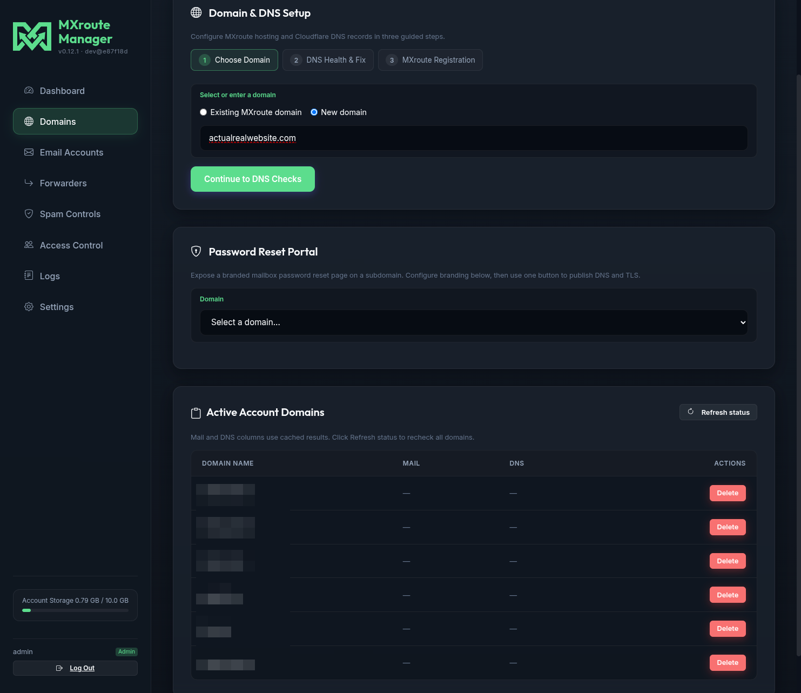
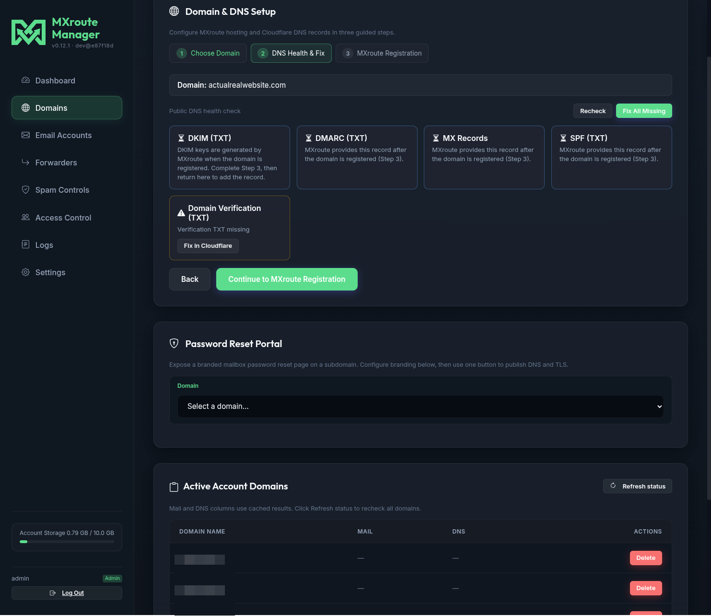
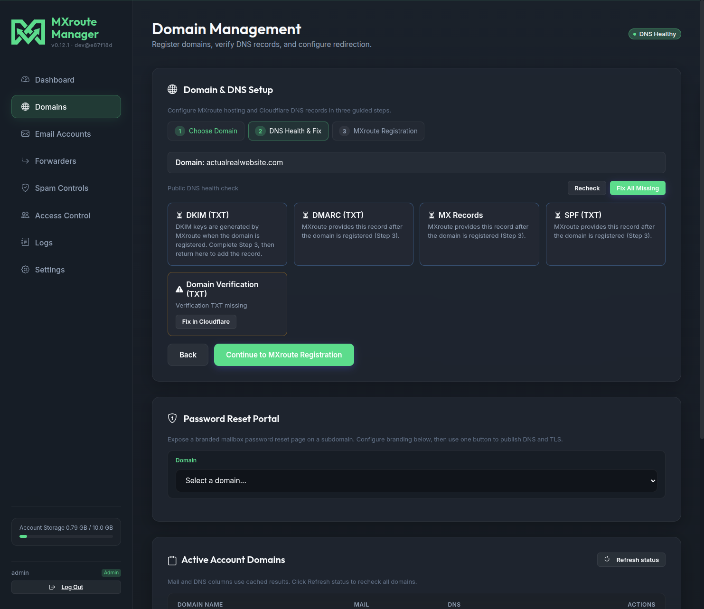
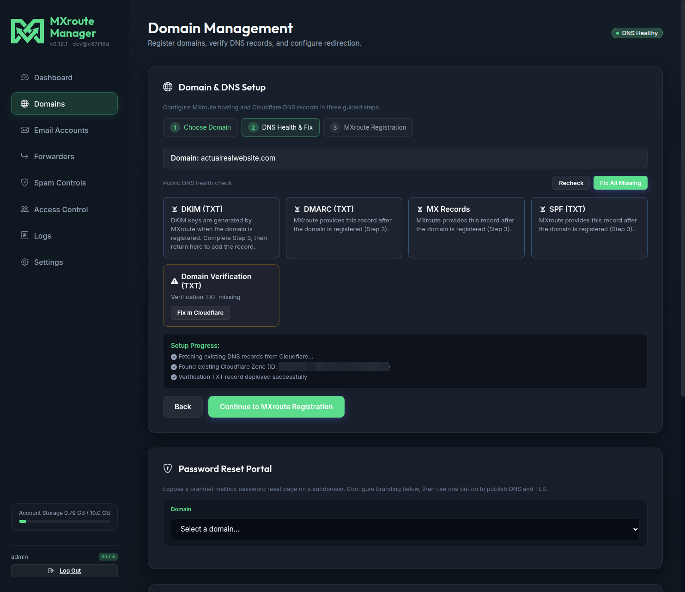
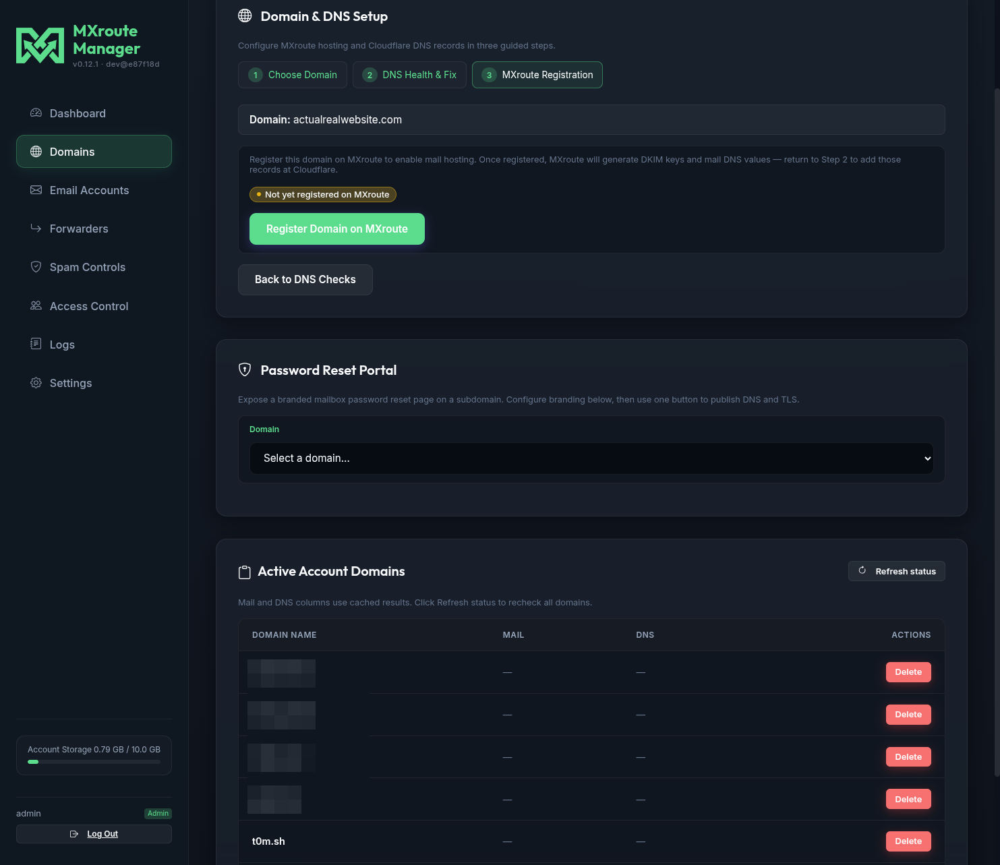
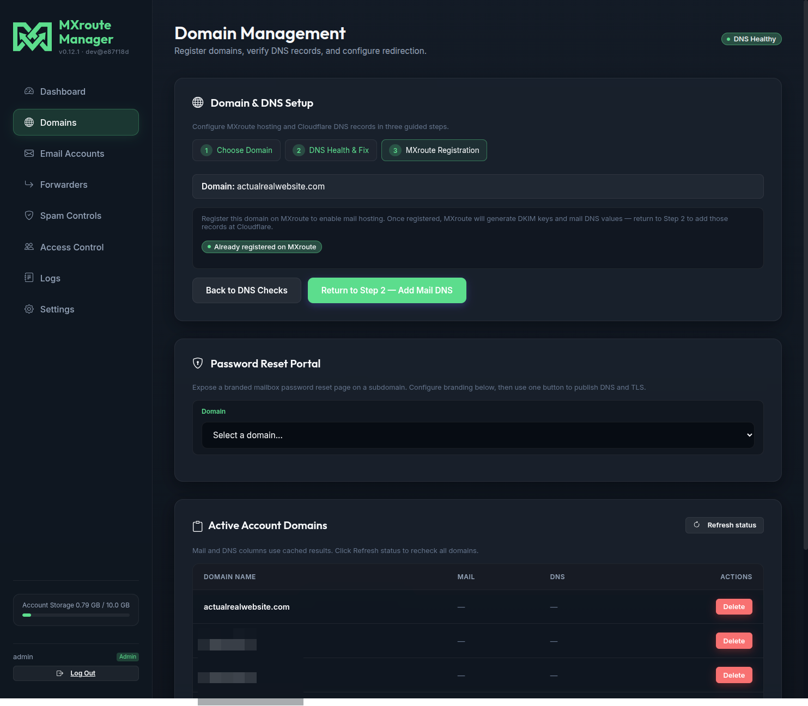
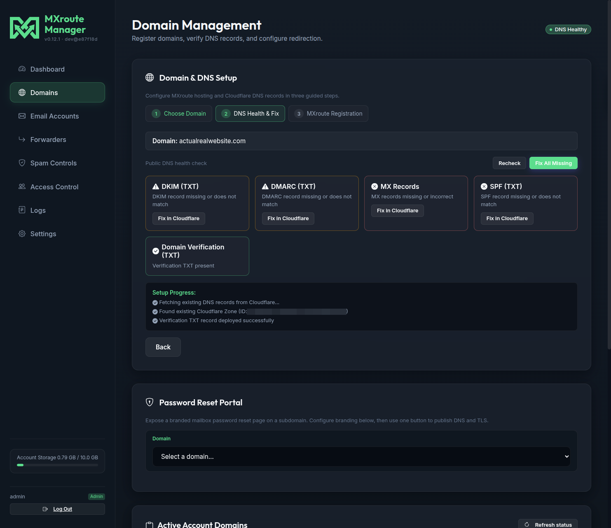
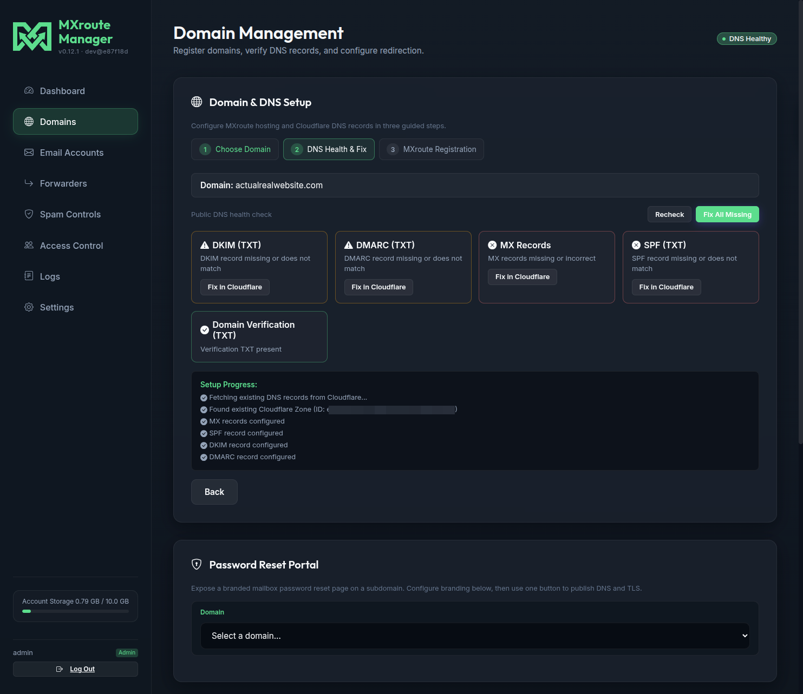
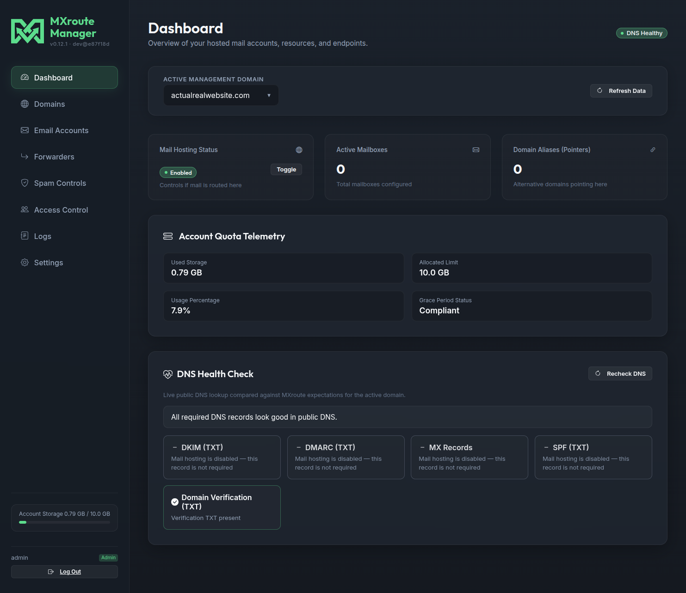

# Adding a domain

This guide walks through onboarding a **new domain** in MXroute Manager: domain verification, MXroute registration, and mail DNS at Cloudflare. The flow uses the **Domain & DNS Setup** wizard on the **Domains** tab.

Screenshots in this guide come from a live setup of `actualrealwebsite.com`. Your domain name and record values will differ, but the steps are the same.

## Before you start

| Requirement | Why |
| --- | --- |
| **MXroute API** configured | Settings or `.env` (`MX_SERVER`, `MX_USER`, `MX_API_KEY`). See [Configuration](configuration.md). |
| **Domain in your MXroute account quota** | Registration happens through the wizard, not the MXroute panel. |
| **Cloudflare** (recommended) | The wizard can create and update DNS records with **Fix in Cloudflare** and **Fix All Missing**. Set `CF_API_TOKEN` and `CF_ACCOUNT_ID` in Settings or `.env`. |
| **Domain zone in Cloudflare** | The domain must already use Cloudflare nameservers so the app can manage its DNS. |

You need **admin** access. Delegated users cannot register domains or run the DNS wizard.

## Overview

The wizard has three steps:

1. **Choose Domain** - pick an existing MXroute domain or enter a new one.
2. **DNS Health & Fix** - public DNS checks and one-click Cloudflare fixes.
3. **MXroute Registration** - register the domain on MXroute so DKIM and mail records become available.

Mail records (MX, SPF, DKIM, DMARC) only exist **after** Step 3. You will visit Step 2 twice: first for domain verification, then again for mail DNS.

## Step 1: Choose your domain

1. Open **Domains** in the sidebar.
2. In **Domain & DNS Setup**, leave **New domain** selected (or choose **Existing MXroute domain** if the domain is already on MXroute and you only need DNS help).
3. Enter the domain name (for example `actualrealwebsite.com`).
4. Click **Continue to DNS Checks**.

The wizard moves to Step 2 and runs a public DNS health check for that domain.

## Step 2: Domain verification (first pass)

On the first visit to Step 2, focus on **Domain Verification (TXT)**. MXroute needs this record before it will accept registration.

You may see other checks (MX, SPF, DKIM, DMARC) marked as not required yet. That is normal until the domain is registered on MXroute.

### Fix verification in Cloudflare

If verification is missing or wrong:

1. Find the **Domain Verification (TXT)** row.
2. Click **Fix in Cloudflare** on that row (or use the per-record button shown in the grid).
3. Watch the **Setup Progress** log at the bottom of Step 2. It should report the TXT record as added or already correct.
4. Click **Recheck** if you want to refresh the grid after DNS propagates.

Public DNS can take a minute to update. If **Recheck** still fails, wait and try again.

When verification passes, click **Continue to MXroute Registration** to open Step 3.

## Step 3: Register on MXroute

Step 3 registers the domain with MXroute and generates per-domain mail settings (including DKIM).

1. Confirm the domain banner matches the domain you entered.
2. Click **Register Domain on MXroute**.
3. Wait for the success state. If registration fails, the UI usually points you back to Step 2 (often verification TXT still missing in public DNS).

After success, click **Return to Step 2 - Add Mail DNS** (or use **Back to DNS Checks**) to configure mail records.

## Step 2 again: Mail DNS (MX, SPF, DKIM, DMARC)

Once the domain is registered, Step 2 shows the full mail DNS grid. MX, SPF, DKIM, and DMARC should now have expected values from MXroute.

### Fix all mail records

1. Click **Fix All Missing** at the top of the DNS grid (visible when Cloudflare is configured and records are missing).
2. Review **Setup Progress** as each record is created or skipped if already correct.
3. Click **Recheck** until the grid shows all required records healthy.

The wizard is idempotent: re-running fixes is safe. Existing correct records are skipped.

When everything looks good, click **Finish Setup**.

## Enable mail hosting

Registration and DNS do not turn on mail routing by themselves. On the **Dashboard**, select the domain and use **Mail Hosting Status → Toggle** to enable hosting for that domain.

With hosting enabled you can provision mailboxes under **Email Accounts**, configure forwarders, and use spam controls for that domain.

## Quick reference

| Step | What you do | What success looks like |
| --- | --- | --- |
| 1 | Enter domain, continue | Wizard opens Step 2 |
| 2 (first) | Fix verification TXT | Domain Verification check passes |
| 3 | Register Domain on MXroute | Success message on Step 3 |
| 2 (second) | Fix All Missing for mail DNS | MX, SPF, DKIM, DMARC all healthy |
| Dashboard | Toggle mail hosting on | **Enabled** badge on Dashboard |

## Troubleshooting

| Problem | What to try |
| --- | --- |
| **Fix in Cloudflare** missing or greyed out | Set Cloudflare API token and account ID in **Settings**. Confirm the zone exists in that Cloudflare account. |
| Verification TXT fixed but Recheck still fails | DNS propagation delay. Wait a few minutes and **Recheck** again. |
| **Register Domain on MXroute** fails | Return to Step 2 and confirm verification TXT is present in public DNS. |
| DKIM or mail records empty before Step 3 | Expected. Complete registration first, then return to Step 2. |
| Banner says Cloudflare not configured but fixes work | Stale UI notice; if **Fix in Cloudflare** succeeds, your credentials are fine. |
| Domain registered but mail does not flow | Enable **Mail Hosting** on the Dashboard for that domain. |

## What to do next

| Goal | Guide |
| --- | --- |
| Create mailboxes | **Email Accounts** tab in the UI |
| Branded password reset portal | [Password reset - Branded portals](password-reset.md#branded-reset-portals) |
| Delegate access to a domain | [Access control](access-control.md) |
| Environment and API keys | [Configuration](configuration.md) |

## Related guides

| Guide | Topic |
| --- | --- |
| [Getting started](getting-started.md) | First install and login |
| [Configuration](configuration.md) | Cloudflare and MXroute settings |
| [Password reset](password-reset.md) | Reset portal and mailbox recovery |
| [Access control](access-control.md) | Delegated users |
