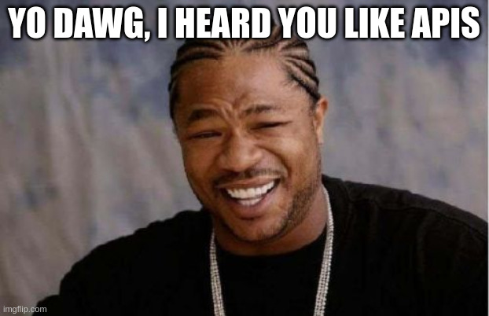

# The API (yes, an API for your APIs)



MXroute Manager already talks to MXroute and Cloudflare on your behalf. The HTTP API is the same machinery, exposed so you can script it: provision a mailbox from CI, fix DNS from a cron job, or glue this app into whatever automation stack you already run.

You are not getting a second mail platform. You are getting a polite middle layer that speaks JSON while the upstream services keep doing their thing.

## Two ways to authenticate

| Client | How | CSRF on writes |
| --- | --- | --- |
| **Browser** | Session cookie after login | Yes (`X-CSRF-Token` header) |
| **Automation** | `Authorization: Bearer mxm_…` API token | No |

### Browser sessions

Sign in through the UI (or OIDC). Mutating requests (`POST`, `PUT`, `PATCH`, `DELETE`) must include the CSRF token from the session or the `csrf_token` cookie:

```http
X-CSRF-Token: <token from cookie or page>
Content-Type: application/json
```

### API tokens (recommended for scripts)

Create tokens under **Access Control → API Tokens** (admin browser session only). Each token is shown **once** at creation. Store it like a password.

Format:

```text
mxm_<random-url-safe-string>
```

Example request:

```bash
curl -sS \
  -H "Authorization: Bearer mxm_your_token_here" \
  -H "Content-Type: application/json" \
  https://manager.example.com/api/domains/example.com/email-accounts
```

Tokens use the **same permission model as delegated users**. A token with `emails` on `example.com` can manage mailboxes there but cannot touch other domains. Admin tokens have full API access except they **cannot** create or revoke other API tokens (that stays in the UI on purpose).

## Base URL and health

| Endpoint | Auth | Purpose |
| --- | --- | --- |
| `GET /health` | Public | `{"status":"ok"}` for load balancers and Docker healthchecks |
| `GET /api/me` | Session or token | Current user, grants, admin flag |
| `GET /api/docs` | Admin session | Human-readable route catalog in the browser |
| `GET /api/openapi.json` | Admin session | Machine-readable route list (OpenAPI 3 skeleton) |

Replace `https://manager.example.com` with your real manager hostname in every example.

## Response shape

Successful JSON responses usually look like:

```json
{
  "success": true,
  "data": { }
}
```

Errors:

```json
{
  "success": false,
  "error": {
    "message": "Human-readable reason"
  }
}
```

HTTP status codes follow the usual pattern: `401` unauthorized, `403` forbidden (wrong domain or permission), `400` validation, `404` not found.

## Permissions (scopes)

API tokens and delegated users share these permission keys:

| Permission | Typical routes |
| --- | --- |
| `dashboard` | Domain stats, quota views for a domain |
| `emails` | Mailboxes, recovery email, mail client settings |
| `forwarders` | Forwarders, catch-all, pointers |
| `spam` | SpamAssassin settings and lists |
| `dns` | DNS health, Cloudflare fixes, setup wizard pieces |

Admins bypass checks. Everyone else is limited to domains listed on their token or delegation.

Full matrix: [Access control](access-control.md).

## Common automation recipes

### List domains

```bash
curl -sS -H "Authorization: Bearer $MXM_TOKEN" \
  https://manager.example.com/api/domains
```

### List mailboxes on a domain

```bash
curl -sS -H "Authorization: Bearer $MXM_TOKEN" \
  https://manager.example.com/api/domains/example.com/email-accounts
```

### Create a mailbox

```bash
curl -sS -X POST \
  -H "Authorization: Bearer $MXM_TOKEN" \
  -H "Content-Type: application/json" \
  -d '{"username":"alex","password":"Abcd123!","quota":1024,"limit":9600}' \
  https://manager.example.com/api/domains/example.com/email-accounts
```

### Preview a CSV mailbox import

Validate rows before creating mailboxes (same permission checks as create). The UI parses CSV client-side, then calls this endpoint:

```bash
curl -sS -X POST \
  -H "Authorization: Bearer $MXM_TOKEN" \
  -H "Content-Type: application/json" \
  -d '{"default_domain":"example.com","rows":[{"username":"alice","password":"Abcd123!"}]}' \
  https://manager.example.com/api/email-accounts/import/preview
```

Creation still uses one `POST` per mailbox (the UI caps parallel requests at 3). Download the template from **Email Accounts → Import CSV** in the app. Export uses the same columns (passwords left blank). See [Bulk mailbox CSV](bulk-mailbox-csv.md).

### Fetch IMAP/SMTP settings for a mailbox

```bash
curl -sS -H "Authorization: Bearer $MXM_TOKEN" \
  "https://manager.example.com/api/domains/example.com/mail-client-settings?username=alex"
```

### Fix missing mail DNS (single domain)

```bash
curl -sS -X POST \
  -H "Authorization: Bearer $MXM_TOKEN" \
  -H "Content-Type: application/json" \
  -d '{}' \
  https://manager.example.com/api/domains/example.com/dns/fix
```

Deploy only webmail CNAME:

```bash
curl -sS -X POST \
  -H "Authorization: Bearer $MXM_TOKEN" \
  -H "Content-Type: application/json" \
  -d '{"records":["webmail"]}' \
  https://manager.example.com/api/domains/example.com/dns/fix
```

### Bulk fix unhealthy DNS (admin)

```bash
curl -sS -X POST \
  -H "Authorization: Bearer $MXM_ADMIN_TOKEN" \
  -H "Content-Type: application/json" \
  -d '{"only_unhealthy":true}' \
  https://manager.example.com/api/cloudflare/dns/fix-bulk
```

Webmail is opt-in per domain; bulk fix does not add webmail CNAMEs automatically.

## Example scripts (PowerShell and Bash)

Ready-made scripts live in [docs/examples/](examples/README.md):

| Script | Use case |
| --- | --- |
| `deploy-mailbox.ps1` / `deploy-mailbox.sh` | Provision a mailbox from a terminal or CI job |
| `blacklist-sender.ps1` / `blacklist-sender.sh` | Add an address to SpamAssassin blacklist (Karen from HR, politely) |

Set `MXM_URL` and `MXM_TOKEN`, create a scoped API token, then run. The PowerShell mailbox example:

```powershell
$env:MXM_URL = "https://manager.example.com"
$env:MXM_TOKEN = "mxm_your_token_here"
.\docs\examples\deploy-mailbox.ps1 -Domain "example.com" -Username "alex" -Password "Abcd1234!"
```

Blacklist example (requires `spam` on the domain):

```powershell
.\docs\examples\blacklist-sender.ps1 -Domain "example.com" -Entry "karen@hr.example.com"
```

Bash equivalents use `curl` and the same env vars. See each script's header comments.

### SpamAssassin API quick reference

```bash
# List blacklist
curl -sS -H "Authorization: Bearer $MXM_TOKEN" \
  https://manager.example.com/api/domains/example.com/spam/blacklist

# Add entry (local part or full address)
curl -sS -X POST \
  -H "Authorization: Bearer $MXM_TOKEN" \
  -H "Content-Type: application/json" \
  -d '{"entry":"karen@hr.example.com"}' \
  https://manager.example.com/api/domains/example.com/spam/blacklist

# Remove entry (URL-encode special characters)
curl -sS -X DELETE \
  -H "Authorization: Bearer $MXM_TOKEN" \
  "https://manager.example.com/api/domains/example.com/spam/blacklist/karen%40hr.example.com"
```

## Route groups (cheat sheet)

The in-app **Settings → API reference** link opens `/api/docs` with the live route table. Broad groups:

| Tag | Examples |
| --- | --- |
| **Domains** | `/api/domains`, `/api/domains/<domain>`, mail hosting toggle |
| **Mail** | `/api/domains/<domain>/email-accounts`, forwarders, catch-all |
| **DNS** | `/api/domains/<domain>/dns/setup-health`, `/dns/fix`, reset portal |
| **Cloudflare** | `/api/cloudflare/status`, `/api/cloudflare/dns/fix-bulk` |
| **Spam** | `/api/domains/<domain>/spam/*` |
| **Admin** | `/api/admin/settings`, delegations, logs, notifications |
| **Public** | `/api/public/password-reset/*` (mailbox self-service, no manager login) |

Path parameters use the real domain name (`example.com`), not an internal ID.

## What tokens cannot do

- Open HTML pages as a substitute for logging in (use the API paths under `/api/…`).
- Manage other API tokens (create/revoke/list tokens requires an admin **browser** session).
- Register or delete domains on MXroute unless the token is admin-scoped (same as delegated users).

## Security notes

- Treat `mxm_` tokens like passwords. Revoke compromised tokens immediately under **Access Control**.
- Prefer narrow scopes: a DNS repair bot only needs `dns` on the domains it touches.
- Use HTTPS in production (`FORCE_HTTPS=true`). Tokens sent over plain HTTP can be intercepted.
- Audit events (`mailbox.create`, `dns.health_alert`, etc.) still log actions performed via tokens. See **Audit Logs** and [Notifications](notifications.md).

## Environment tweak

`PUBLIC_URL_SCHEME` (default `https`) controls the scheme used when the app builds public webmail URLs in mail-client settings. Rarely needed unless you run a non-TLS lab environment.

## Related guides

| Guide | Topic |
| --- | --- |
| [Example scripts](examples/README.md) | PowerShell and Bash starters |
| [Access control](access-control.md) | Delegations, API tokens, permission matrix |
| [Configuration](configuration.md) | Env vars, production TLS |
| [Notifications](notifications.md) | DNS health alerts via Apprise |
| [Adding a domain](adding-a-domain.md) | Wizard and DNS fix behaviour |
| [Testing](testing.md) | `test_api_tokens.py` and route tests |
